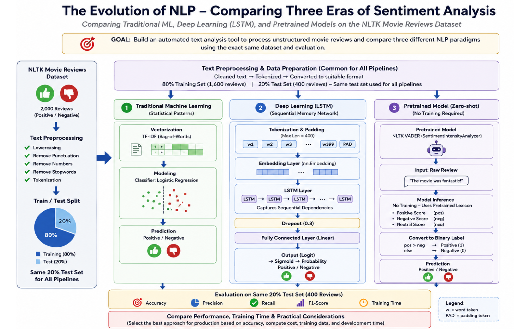

# NLP Sentiment Analysis

A comparative sentiment analysis project evaluating three different NLP approaches on the NLTK Movie Reviews dataset:

1. Traditional Machine Learning — TF-IDF + Logistic Regression
2. Deep Learning — PyTorch Embedding + LSTM
3. Pretrained NLP — NLTK VADER

The project compares predictive performance, computational cost, inference speed, and practical suitability for production deployment.

---

## 1. Project Overview

The objective of this project was to develop and evaluate sentiment-analysis solutions for classifying movie reviews as positive or negative.

The project compares three NLP paradigms using the same dataset and the same held-out test set:

- Traditional statistical machine learning
- Deep learning using a recurrent neural network
- Pretrained sentiment analysis

The main objective was not only to identify the most accurate model, but also to evaluate the trade-offs between predictive quality, training requirements, inference cost, computational complexity, and deployment practicality.

---

## 2. Business Objective

A consultancy firm needs to determine whether it should build a task-specific sentiment-analysis model or use an existing pretrained sentiment model.

The project therefore evaluates:

- Predictive performance
- Training requirements
- Inference speed
- Computational cost
- Development and deployment complexity
- Requirement for labelled training data
- Suitability for production use

The final recommendation is based on both technical performance and operational considerations.

---

## 3. Dataset

This project uses the **NLTK Movie Reviews Corpus** (Sentiment Polarity Dataset Version 2.0).

**Dataset:** [NLTK Movie Reviews Dataset](https://raw.githubusercontent.com/nltk/nltk_data/gh-pages/packages/corpora/movie_reviews.zip)

**Source:** NLTK Data Repository

**Original dataset:** Bo Pang and Lillian Lee

The dataset contains movie reviews labelled as either positive or negative.

### Dataset Summary

- Dataset: NLTK Movie Reviews Corpus
- Total reviews used: 2,000
- Classes: Positive and Negative
- Training set: 1,600 reviews
- Test set: 400 reviews
- Split: 80% Training / 20% Test
- Evaluation: Same held-out 400-review test set for all three approaches

The dataset is obtained through NLTK rather than being uploaded directly to this repository.

The notebook contains the required NLTK download and preprocessing steps.

---

## 4. Data Sourcing and Preprocessing

The reviews were processed using a reusable text-cleaning and preprocessing workflow.

The preprocessing pipeline included:

- Lowercasing text
- Removing punctuation and non-alphabetic noise
- Removing stopwords
- Tokenising reviews
- Creating cleaned review text
- Converting reviews into numerical representations for machine learning

The dataset was divided using an 80/20 train-test split with stratification so that both sentiment classes remained balanced across the split.

All three approaches were evaluated on the same held-out test set to ensure a fair comparison.

---

## 5. Traditional Machine Learning Pipeline

### TF-IDF + Logistic Regression

The first approach uses a traditional machine learning pipeline.

Workflow:

Raw Reviews → Text Cleaning → TF-IDF Vectorization → Logistic Regression → Positive / Negative Prediction → Evaluation

TF-IDF converts the cleaned review text into numerical features representing the importance of words within the corpus.

Logistic Regression then performs binary sentiment classification.

### Results

- Accuracy: **85.50%**
- Precision: **84.13%**
- Recall: **87.50%**
- F1 Score: **0.8578**
- Training Time: **0.4909 seconds**
- Inference Time: **0.00525 seconds for 400 reviews**

This model achieved the strongest overall predictive performance.

---

## 6. Deep Learning Pipeline

### PyTorch Embedding + LSTM

The second approach uses a neural network architecture consisting of:

- Token vocabulary
- PyTorch `nn.Embedding`
- LSTM layer
- Dropout
- Linear output layer

Workflow:

Raw Reviews → Tokenisation → Vocabulary Mapping → Embedding Layer → LSTM → Linear Classification Layer → Positive / Negative Prediction

The model was trained from scratch using the labelled training data.

### Model Configuration

- Vocabulary size: **35,542**
- Embedding dimension: **128**
- LSTM hidden units: **128**
- Dropout: **0.3**
- Output: **1 logit**

### Results

- Accuracy: **53.75%**
- Precision: **57.43%**
- Recall: **29.00%**
- F1 Score: **0.3854**
- Training Time: **550.9 seconds**
- Inference Time: **2.2820 seconds for 400 reviews**

The LSTM did not generalise effectively on this relatively small dataset.

The result demonstrates that a more complex neural architecture does not automatically provide better performance when the available task-specific training data is limited.

---

## 7. Pretrained NLP Pipeline

### NLTK VADER

The third approach uses NLTK VADER as an off-the-shelf sentiment-analysis system.

Unlike the other two approaches, VADER does not require task-specific model training.

Workflow:

Raw Review → VADER Sentiment Analysis → Compound Sentiment Score → Binary Positive / Negative Label

The decision rule used was:

`compound score >= 0.05 → Positive`

`compound score < 0.05 → Negative`

### Results

- Accuracy: **64.75%**
- Precision: **61.13%**
- Recall: **81.00%**
- F1 Score: **0.6968**
- Training Time: **N/A**
- Inference Time: **6.7448 seconds for 400 reviews**

VADER provided a useful pretrained baseline but performed below the task-specific TF-IDF + Logistic Regression model.

---

## 8. Model Comparison

All three approaches were evaluated using the same 400-review held-out test set.

| Model | Accuracy | Precision | Recall | F1 | Training Time | Inference Time |
|---|---:|---:|---:|---:|---:|---:|
| **TF-IDF + Logistic Regression** | **85.50%** | **84.13%** | **87.50%** | **0.8578** | **0.4909 s** | **0.00525 s** |
| PyTorch Embedding + LSTM | 53.75% | 57.43% | 29.00% | 0.3854 | 550.9 s | 2.2820 s |
| NLTK VADER | 64.75% | 61.13% | 81.00% | 0.6968 | N/A | 6.7448 s |

### Key Findings

The comparison shows that:

- TF-IDF + Logistic Regression achieved the highest accuracy.
- TF-IDF + Logistic Regression achieved the highest F1 score.
- TF-IDF + Logistic Regression had the lowest training cost.
- TF-IDF + Logistic Regression had the fastest measured inference.
- VADER required no task-specific training.
- VADER performed better than the LSTM but below the task-specific statistical model.
- The LSTM required substantially more computational effort without achieving competitive predictive performance.

---

## 9. Why Did the Pretrained Model Perform Differently?

VADER is a general-purpose sentiment-analysis system based on sentiment lexicons and rules.

However, the target dataset consists of long-form movie reviews containing:

- Nuanced criticism
- Context-dependent sentiment
- Mixed positive and negative language
- Movie-specific expressions

This creates a domain difference between the language VADER was designed to handle and the language found in the movie-review dataset.

VADER achieved:

- Accuracy: **64.75%**
- F1 Score: **0.6968**
- Positive Recall: **81.00%**

Its performance was below the task-specific TF-IDF model, demonstrating that pretrained sentiment systems can reduce development effort but may not perform as well as models trained specifically for the target domain.

This demonstrates the importance of domain adaptation when applying pretrained NLP systems.

---

## 10. Evaluation Metrics

The project used multiple evaluation metrics rather than relying on accuracy alone.

### Accuracy

Measures the overall proportion of correctly classified reviews.

### Precision

Measures how many reviews predicted as positive were actually positive.

### Recall

Measures how many actual positive reviews were correctly identified.

### F1 Score

Provides a balanced measure of precision and recall.

Using all four metrics provides a more complete view of model behaviour and prevents conclusions based only on a single performance measure.

---

## 11. Error Analysis

The model comparison revealed important differences in prediction behaviour.

### TF-IDF + Logistic Regression

The model achieved strong and balanced performance across precision and recall, making it the most reliable overall approach for this dataset.

### LSTM

The LSTM produced significantly lower recall and F1 score.

Its 53.75% accuracy indicates that the model did not generalise effectively to the held-out test data.

The result also highlights the challenge of training a neural sequence model from scratch when the amount of labelled training data is relatively small.

### VADER

VADER achieved strong positive recall but substantially weaker negative recall.

This suggests that its general sentiment rules were more effective at identifying positive sentiment than detecting the more nuanced negative sentiment present in movie reviews.

---

## 12. Computational and Operational Comparison

Model selection was based not only on predictive performance but also on operational requirements.

### TF-IDF + Logistic Regression

- Very low training cost
- Very fast inference
- Simple architecture
- Easy to retrain
- Requires labelled task-specific data
- Strongest predictive performance

### PyTorch LSTM

- High training cost
- More complex architecture
- Higher inference cost
- Requires labelled training data
- Did not produce competitive performance on this dataset

### VADER

- No task-specific training
- Simple integration
- Useful when labelled data is unavailable
- Lower predictive performance than TF-IDF + Logistic Regression
- Domain adaptation remains a limitation

---

## 13. Production Recommendation

### Recommended Model: TF-IDF + Logistic Regression

For the current use case, **TF-IDF + Logistic Regression is the recommended production model**.

It achieved:

- **85.50% accuracy**
- **0.8578 F1 score**
- **0.4909 seconds training time**
- **0.00525 seconds inference time for 400 reviews**

The model therefore provides the best combination of:

- Predictive quality
- Speed
- Low computational cost
- Simplicity
- Reproducibility
- Ease of retraining
- Operational maintainability

The LSTM should not be preferred for the current dataset because its additional complexity and computational cost did not result in improved predictive performance.

VADER can be retained as a lightweight baseline or fallback when labelled training data is unavailable.

---

## 14. Key Business Insights

The project demonstrates several practical lessons:

1. A more sophisticated model is not necessarily a better production model.
2. Task-specific labelled data can outperform a general pretrained sentiment system.
3. Model selection should consider both predictive quality and operational cost.
4. Multiple evaluation metrics provide better insight than accuracy alone.
5. Domain adaptation is important when using pretrained NLP systems.
6. Dataset size can significantly affect the performance of neural models trained from scratch.

---

## 15. Project Limitations

The project has several limitations:

- The dataset contains only 2,000 reviews used in this experiment.
- The dataset represents movie reviews and may not generalise to other domains.
- The LSTM was trained from scratch and therefore had limited data available for learning useful representations.
- No large pretrained transformer model was evaluated.
- Hyperparameter optimisation for the deep learning model was limited.
- The evaluation uses a single held-out test split rather than repeated cross-validation.
- The results may change with a larger and more diverse dataset.

---

## 16. Future Improvements

Potential future improvements include:

- Training with a larger labelled dataset.
- Applying systematic hyperparameter tuning to the LSTM.
- Improving sequence-length handling and padding strategies.
- Evaluating bidirectional LSTM architectures.
- Using pretrained word embeddings.
- Exploring transformer-based models such as BERT.
- Performing cross-validation for more robust performance estimation.
- Conducting deeper error analysis on misclassified reviews.
- Evaluating the models on additional sentiment datasets.
- Comparing model performance across different domains.

---

## 17. Reproducibility

The complete implementation is provided in the Jupyter/Google Colab notebook included in this repository.

The notebook contains:

- Dataset loading
- Text preprocessing
- Train-test splitting
- TF-IDF vectorisation
- Logistic Regression training
- PyTorch Embedding + LSTM implementation
- VADER inference
- Model evaluation
- Performance comparison
- Training-time comparison
- Inference-time comparison
- Final production recommendation

The NLTK Movie Reviews dataset is downloaded programmatically when the notebook is executed.

---

## 18. Repository Structure

nlp-sentiment-analysis/
│
├── README.md
│
└── notebook/
    ├── .gitkeep
    └── NLP_Assignment_Sentiment_Analysis.ipynb

---

## 19. Technologies Used

- Python
- Google Colaboratory
- NLTK
- Pandas
- NumPy
- Scikit-learn
- PyTorch
- Matplotlib
- Seaborn
- TF-IDF
- Logistic Regression
- LSTM
- VADER
- Natural Language Processing
- Machine Learning
- Deep Learning

---

## 20. Assignment Feedback Addressed

The project received strong overall feedback, with a provisional score of **18.34/20**.

The main improvement area identified by the reviewer was the Deep Learning Pipeline.

The feedback highlighted that the LSTM performance was substantially below the traditional ML model and recommended improving sequence/padding handling and investigating the cause of the weak neural-model performance.

The current submitted notebook preserves the original experimental implementation and results.

For future improvement, the LSTM pipeline can be enhanced through:

- More robust sequence-length handling
- Improved padding/masking
- More systematic hyperparameter tuning
- Larger training datasets
- Additional neural architectures
- More extensive error analysis

The project analysis therefore treats the LSTM result as a limitation of the current experiment rather than interpreting the low score as evidence that LSTM is inherently unsuitable for sentiment analysis.

---

## 21. Conclusion

This project implemented and compared three different approaches to sentiment analysis:

**Traditional Machine Learning**

TF-IDF + Logistic Regression

**Deep Learning**

PyTorch Embedding + LSTM

**Pretrained NLP**

NLTK VADER

The experimental results demonstrate that the simplest approach was the strongest for this dataset.

TF-IDF + Logistic Regression achieved the highest accuracy and F1 score while also requiring substantially less training and inference time than the LSTM.

VADER provided a useful no-training alternative but was affected by the domain difference between general sentiment rules and long-form movie reviews.

The overall conclusion is that model selection should be based on the complete trade-off between predictive performance, computational requirements, development complexity, data requirements, and deployment practicality.

For the current use case, **TF-IDF + Logistic Regression is the recommended production solution**.

---

## Author

**Sunita Baloda**

**M.Sc. Data Science & Artificial Intelligence**
